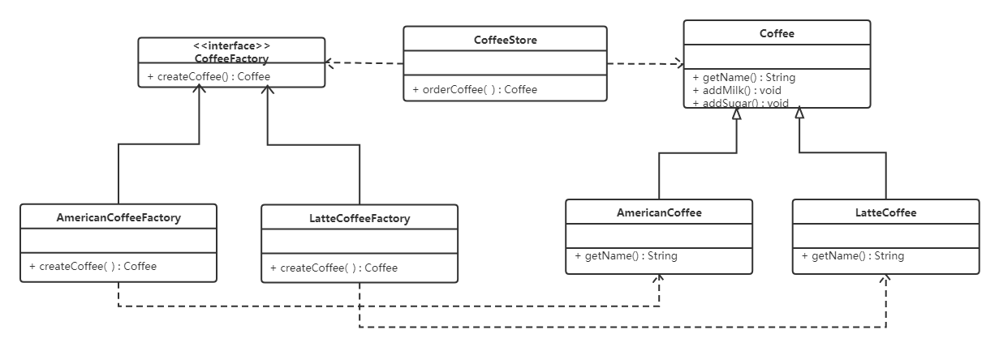
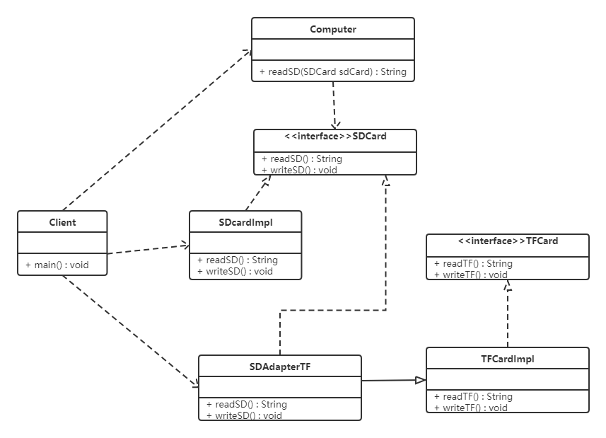
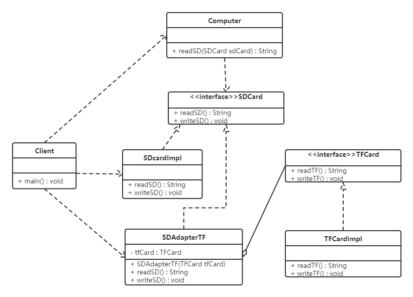

# 设计模式

## UML图

统一建模语言（Unified Modeling Language，UML）是用来设计软件的可视化建模语言。它的特点是简单、统一、图形化、能表达软件设计中的动态与静态信息。

UML 从目标系统的不同角度出发，定义了用例图、类图、对象图、状态图、活动图、时序图、协作图、构件图、部署图等 9 种图。

### 类图概述

类图(Class diagram)是显示了模型的静态结构，特别是模型中存在的类、类的内部结构以及它们与其他类的关系等。类图不显示暂时性的信息。类图是面向对象建模的主要组成部分。

### 类图的作用

* 在软件工程中，类图是一种静态的结构图，描述了系统的类的集合，类的属性和类之间的关系，可以简化了人们对系统的理解；
* 类图是系统分析和设计阶段的重要产物，是系统编码和测试的重要模型。

### 类图表示法

#### 类的表示方式 

在UML类图中，类使用包含类名、属性(field) 和方法(method) 且带有分割线的矩形来表示，比如下图表示一个Employee类，它包含name,age和address这3个属性，以及work()方法。 


属性/方法名称前加的加号和减号表示了这个属性/方法的可见性，UML类图中表示可见性的符号有三种：

* +：表示public

* -：表示private

* #：表示protected

属性的完整表示方式是： **可见性  名称 ：类型 [ = 缺省值]**  

方法的完整表示方式是： **可见性  名称(参数列表) [ ： 返回类型]**

> 注意：
>
> ​	1，中括号中的内容表示是可选的
>
> ​	2，也有将类型放在变量名前面，返回值类型放在方法名前面

**举个栗子：**


上图Demo类定义了三个方法：

* method()方法：修饰符为public，没有参数，没有返回值。
* method1()方法：修饰符为private，没有参数，返回值类型为String。
* method2()方法：修饰符为protected，接收两个参数，第一个参数类型为int，第二个参数类型为String，返回值类型是int。

#### 类与类之间关系的表示方式

##### 1 关联关系

关联关系是对象之间的一种引用关系，用于表示一类对象与另一类对象之间的联系，如老师和学生、师傅和徒弟、丈夫和妻子等。关联关系是类与类之间最常用的一种关系，分为一般关联关系、聚合关系和组合关系。我们先介绍一般关联。

关联又可以分为单向关联，双向关联，自关联。

**1，单向关联**


在UML类图中单向关联用一个带箭头的实线表示。上图表示每个顾客都有一个地址，这通过让Customer类持有一个类型为Address的成员变量类实现。

**2，双向关联**


从上图中我们很容易看出，所谓的双向关联就是双方各自持有对方类型的成员变量。

在UML类图中，双向关联用一个不带箭头的直线表示。上图中在Customer类中维护一个List\<Product>，表示一个顾客可以购买多个商品；在Product类中维护一个Customer类型的成员变量表示这个产品被哪个顾客所购买。

**3，自关联**


自关联在UML类图中用一个带有箭头且指向自身的线表示。上图的意思就是Node类包含类型为Node的成员变量，也就是“自己包含自己”。


##### 2 聚合关系

聚合关系是关联关系的一种，是强关联关系，是整体和部分之间的关系。

聚合关系也是通过成员对象来实现的，其中成员对象是整体对象的一部分，但是成员对象可以脱离整体对象而独立存在。例如，学校与老师的关系，学校包含老师，但如果学校停办了，老师依然存在。

在 UML 类图中，聚合关系可以用带空心菱形的实线来表示，菱形指向整体。下图所示是大学和教师的关系图：


##### 3 组合关系

组合表示类之间的整体与部分的关系，但它是一种更强烈的聚合关系。

在组合关系中，整体对象可以控制部分对象的生命周期，一旦整体对象不存在，部分对象也将不存在，部分对象不能脱离整体对象而存在。例如，头和嘴的关系，没有了头，嘴也就不存在了。

在 UML 类图中，组合关系用带实心菱形的实线来表示，菱形指向整体。下图所示是头和嘴的关系图：


##### 4 依赖关系

依赖关系是一种使用关系，它是对象之间耦合度最弱的一种关联方式，是临时性的关联。在代码中，某个类的方法通过局部变量、方法的参数或者对静态方法的调用来访问另一个类（被依赖类）中的某些方法来完成一些职责。

在 UML 类图中，依赖关系使用带箭头的虚线来表示，箭头从使用类指向被依赖的类。下图所示是司机和汽车的关系图，司机驾驶汽车：


##### 5 继承关系

继承关系是对象之间耦合度最大的一种关系，表示一般与特殊的关系，是父类与子类之间的关系，是一种继承关系。

在 UML 类图中，泛化关系用带空心三角箭头的实线来表示，箭头从子类指向父类。在代码实现时，使用面向对象的继承机制来实现泛化关系。例如，Student 类和 Teacher 类都是 Person 类的子类，其类图如下图所示：


##### 6 实现关系

实现关系是接口与实现类之间的关系。在这种关系中，类实现了接口，类中的操作实现了接口中所声明的所有的抽象操作。

在 UML 类图中，实现关系使用带空心三角箭头的虚线来表示，箭头从实现类指向接口。例如，汽车和船实现了交通工具，其类图如图 9 所示。


  


## 软件设计原则

在软件开发中，为了提高软件系统的可维护性和可复用性，增加软件的可扩展性和灵活性，程序员要尽量根据6条原则来开发程序，从而提高软件开发效率、节约软件开发成本和维护成本。

### 1 开闭原则

**对扩展开放，对修改关闭**。在程序需要进行拓展的时候，不能去修改原有的代码，实现一个热插拔的效果。简言之，是为了使程序的扩展性好，易于维护和升级。

想要达到这样的效果，我们需要使用接口和抽象类。

因为抽象灵活性好，适应性广，只要抽象的合理，可以基本保持软件架构的稳定。而软件中易变的细节可以从抽象派生来的实现类来进行扩展，当软件需要发生变化时，只需要根据需求重新派生一个实现类来扩展就可以了。

下面以 `搜狗输入法` 的皮肤为例介绍开闭原则的应用。

【例】`搜狗输入法` 的皮肤设计。

分析：`搜狗输入法` 的皮肤是输入法背景图片、窗口颜色和声音等元素的组合。用户可以根据自己的喜爱更换自己的输入法的皮肤，也可以从网上下载新的皮肤。这些皮肤有共同的特点，可以为其定义一个抽象类（AbstractSkin），而每个具体的皮肤（DefaultSpecificSkin和HeimaSpecificSkin）是其子类。用户窗体可以根据需要选择或者增加新的主题，而不需要修改原代码，所以它是满足开闭原则的。


### 2 里氏代换原则

里氏代换原则是面向对象设计的基本原则之一。

里氏代换原则：任何基类可以出现的地方，子类一定可以出现。通俗理解：子类可以扩展父类的功能，但不能改变父类原有的功能。换句话说，子类继承父类时，除添加新的方法完成新增功能外，尽量不要重写父类的方法。

如果通过重写父类的方法来完成新的功能，这样写起来虽然简单，但是整个继承体系的可复用性会比较差，特别是运用多态比较频繁时，程序运行出错的概率会非常大。

下面看一个里氏替换原则中经典的一个例子

【例】正方形不是长方形。

在数学领域里，正方形毫无疑问是长方形，它是一个长宽相等的长方形。所以，我们开发的一个与几何图形相关的软件系统，就可以顺理成章的让正方形继承自长方形。


代码如下：

**长方形类（Rectangle）：**

```java
public class Rectangle {
    private double length;
    private double width;

    public double getLength() {
        return length;
    }

    public void setLength(double length) {
        this.length = length;
    }

    public double getWidth() {
        return width;
    }

    public void setWidth(double width) {
        this.width = width;
    }
}
```

**正方形（Square）：**

由于正方形的长和宽相同，所以在方法setLength和setWidth中，对长度和宽度都需要赋相同值。

```java
public class Square extends Rectangle {
    
    public void setWidth(double width) {
        super.setLength(width);
        super.setWidth(width);
    }

    public void setLength(double length) {
        super.setLength(length);
        super.setWidth(length);
    }
}
```

类RectangleDemo是我们的软件系统中的一个组件，它有一个resize方法依赖基类Rectangle，resize方法是RectandleDemo类中的一个方法，用来实现宽度逐渐增长的效果。

```java
public class RectangleDemo {
    
    public static void resize(Rectangle rectangle) {
        while (rectangle.getWidth() <= rectangle.getLength()) {
            rectangle.setWidth(rectangle.getWidth() + 1);
        }
    }

    //打印长方形的长和宽
    public static void printLengthAndWidth(Rectangle rectangle) {
        System.out.println(rectangle.getLength());
        System.out.println(rectangle.getWidth());
    }

    public static void main(String[] args) {
        Rectangle rectangle = new Rectangle();
        rectangle.setLength(20);
        rectangle.setWidth(10);
        resize(rectangle);
        printLengthAndWidth(rectangle);

        System.out.println("============");

        Rectangle rectangle1 = new Square();
        rectangle1.setLength(10);
        resize(rectangle1);
        printLengthAndWidth(rectangle1);
    }
}
```

我们运行一下这段代码就会发现，假如我们把一个普通长方形作为参数传入resize方法，就会看到长方形宽度逐渐增长的效果，当宽度大于长度,代码就会停止，这种行为的结果符合我们的预期；假如我们再把一个正方形作为参数传入resize方法后，就会看到正方形的宽度和长度都在不断增长，代码会一直运行下去，直至系统产生溢出错误。所以，普通的长方形是适合这段代码的，正方形不适合。
我们得出结论：在resize方法中，Rectangle类型的参数是不能被Square类型的参数所代替，如果进行了替换就得不到预期结果。因此，Square类和Rectangle类之间的继承关系违反了里氏代换原则，它们之间的继承关系不成立，正方形不是长方形。

如何改进呢？此时我们需要重新设计他们之间的关系。抽象出来一个四边形接口(Quadrilateral)，让Rectangle类和Square类实现Quadrilateral接口


### 3 依赖倒转原则

高层模块不应该依赖低层模块，两者都应该依赖其抽象；抽象不应该依赖细节，细节应该依赖抽象。简单的说就是要求对抽象进行编程，不要对实现进行编程，这样就降低了客户与实现模块间的耦合。

下面看一个例子来理解依赖倒转原则

【例】组装电脑

现要组装一台电脑，需要配件cpu，硬盘，内存条。只有这些配置都有了，计算机才能正常的运行。选择cpu有很多选择，如Intel，AMD等，硬盘可以选择希捷，西数等，内存条可以选择金士顿，海盗船等。

**类图如下：**


代码如下：

**希捷硬盘类（XiJieHardDisk）:**

```java
public class XiJieHardDisk implements HardDisk {

    public void save(String data) {
        System.out.println("使用希捷硬盘存储数据" + data);
    }

    public String get() {
        System.out.println("使用希捷希捷硬盘取数据");
        return "数据";
    }
}
```

**Intel处理器（IntelCpu）：**

```java
public class IntelCpu implements Cpu {

    public void run() {
        System.out.println("使用Intel处理器");
    }
}
```

**金士顿内存条（KingstonMemory）：**

```java
public class KingstonMemory implements Memory {

    public void save() {
        System.out.println("使用金士顿作为内存条");
    }
}
```

**电脑（Computer）：**

```java
public class Computer {

    private XiJieHardDisk hardDisk;
    private IntelCpu cpu;
    private KingstonMemory memory;

    public IntelCpu getCpu() {
        return cpu;
    }

    public void setCpu(IntelCpu cpu) {
        this.cpu = cpu;
    }

    public KingstonMemory getMemory() {
        return memory;
    }

    public void setMemory(KingstonMemory memory) {
        this.memory = memory;
    }

    public XiJieHardDisk getHardDisk() {
        return hardDisk;
    }

    public void setHardDisk(XiJieHardDisk hardDisk) {
        this.hardDisk = hardDisk;
    }

    public void run() {
        System.out.println("计算机工作");
        cpu.run();
        memory.save();
        String data = hardDisk.get();
        System.out.println("从硬盘中获取的数据为：" + data);
    }
}
```

**测试类（TestComputer）：**

测试类用来组装电脑。

```java
public class TestComputer {
    public static void main(String[] args) {
        Computer computer = new Computer();
        computer.setHardDisk(new XiJieHardDisk());
        computer.setCpu(new IntelCpu());
        computer.setMemory(new KingstonMemory());

        computer.run();
    }
}
```

上面代码可以看到已经组装了一台电脑，但是似乎组装的电脑的cpu只能是Intel的，内存条只能是金士顿的，硬盘只能是希捷的，这对用户肯定是不友好的，用户有了机箱肯定是想按照自己的喜好，选择自己喜欢的配件。

根据依赖倒转原则进行改进：

代码我们只需要修改Computer类，让Computer类依赖抽象（各个配件的接口），而不是依赖于各个组件具体的实现类。

**类图如下：**


**电脑（Computer）：**

```java
public class Computer {

    private HardDisk hardDisk;
    private Cpu cpu;
    private Memory memory;

    public HardDisk getHardDisk() {
        return hardDisk;
    }

    public void setHardDisk(HardDisk hardDisk) {
        this.hardDisk = hardDisk;
    }

    public Cpu getCpu() {
        return cpu;
    }

    public void setCpu(Cpu cpu) {
        this.cpu = cpu;
    }

    public Memory getMemory() {
        return memory;
    }

    public void setMemory(Memory memory) {
        this.memory = memory;
    }

    public void run() {
        System.out.println("计算机工作");
    }
}
```

面向对象的开发很好的解决了这个问题，一般情况下抽象的变化概率很小，让用户程序依赖于抽象，实现的细节也依赖于抽象。即使实现细节不断变动，只要抽象不变，客户程序就不需要变化。这大大降低了客户程序与实现细节的耦合度。


### 4 接口隔离原则

客户端不应该被迫依赖于它不使用的方法；一个类对另一个类的依赖应该建立在最小的接口上。

下面看一个例子来理解接口隔离原则

【例】安全门案例

我们需要创建一个`黑马`品牌的安全门，该安全门具有防火、防水、防盗的功能。可以将防火，防水，防盗功能提取成一个接口，形成一套规范。类图如下：


上面的设计我们发现了它存在的问题，黑马品牌的安全门具有防盗，防水，防火的功能。现在如果我们还需要再创建一个传智品牌的安全门，而该安全门只具有防盗、防水功能呢？很显然如果实现SafetyDoor接口就违背了接口隔离原则，那么我们如何进行修改呢？看如下类图：


代码如下：

**AntiTheft（接口）：**

```java
public interface AntiTheft {
    void antiTheft();
}
```

**Fireproof（接口）：**

```java
public interface Fireproof {
    void fireproof();
}
```

**Waterproof（接口）：**

```java
public interface Waterproof {
    void waterproof();
}
```

**HeiMaSafetyDoor（类）：**

```java
public class HeiMaSafetyDoor implements AntiTheft,Fireproof,Waterproof {
    public void antiTheft() {
        System.out.println("防盗");
    }

    public void fireproof() {
        System.out.println("防火");
    }


    public void waterproof() {
        System.out.println("防水");
    }
}
```

**ItcastSafetyDoor（类）：**

```java
public class ItcastSafetyDoor implements AntiTheft,Fireproof {
    public void antiTheft() {
        System.out.println("防盗");
    }

    public void fireproof() {
        System.out.println("防火");
    }
}
```


### 5 迪米特法则

迪米特法则又叫最少知识原则。

只和你的直接朋友交谈，不跟“陌生人”说话（Talk only to your immediate friends and not to strangers）。

其含义是：如果两个软件实体无须直接通信，那么就不应当发生直接的相互调用，可以通过第三方转发该调用。其目的是降低类之间的耦合度，提高模块的相对独立性。

迪米特法则中的“朋友”是指：当前对象本身、当前对象的成员对象、当前对象所创建的对象、当前对象的方法参数等，这些对象同当前对象存在关联、聚合或组合关系，可以直接访问这些对象的方法。

下面看一个例子来理解迪米特法则

【例】明星与经纪人的关系实例

明星由于全身心投入艺术，所以许多日常事务由经纪人负责处理，如和粉丝的见面会，和媒体公司的业务洽淡等。这里的经纪人是明星的朋友，而粉丝和媒体公司是陌生人，所以适合使用迪米特法则。

类图如下：


代码如下：

**明星类（Star）**

```java
public class Star {
    private String name;

    public Star(String name) {
        this.name=name;
    }

    public String getName() {
        return name;
    }
}
```

**粉丝类（Fans）**

```java
public class Fans {
    private String name;

    public Fans(String name) {
        this.name=name;
    }

    public String getName() {
        return name;
    }
}
```

**媒体公司类（Company）**

```java
public class Company {
    private String name;

    public Company(String name) {
        this.name=name;
    }

    public String getName() {
        return name;
    }
}
```

**经纪人类（Agent）**

```java
public class Agent {
    private Star star;
    private Fans fans;
    private Company company;

    public void setStar(Star star) {
        this.star = star;
    }

    public void setFans(Fans fans) {
        this.fans = fans;
    }

    public void setCompany(Company company) {
        this.company = company;
    }

    public void meeting() {
        System.out.println(fans.getName() + "与明星" + star.getName() + "见面了。");
    }

    public void business() {
        System.out.println(company.getName() + "与明星" + star.getName() + "洽淡业务。");
    }
}
```


### 6 合成复用原则

合成复用原则是指：尽量先使用组合或者聚合等关联关系来实现，其次才考虑使用继承关系来实现。

通常类的复用分为继承复用和合成复用两种。

继承复用虽然有简单和易实现的优点，但它也存在以下缺点：

1. 继承复用破坏了类的封装性。因为继承会将父类的实现细节暴露给子类，父类对子类是透明的，所以这种复用又称为“白箱”复用。
2. 子类与父类的耦合度高。父类的实现的任何改变都会导致子类的实现发生变化，这不利于类的扩展与维护。
3. 它限制了复用的灵活性。从父类继承而来的实现是静态的，在编译时已经定义，所以在运行时不可能发生变化。


采用组合或聚合复用时，可以将已有对象纳入新对象中，使之成为新对象的一部分，新对象可以调用已有对象的功能，它有以下优点：

1. 它维持了类的封装性。因为成分对象的内部细节是新对象看不见的，所以这种复用又称为“黑箱”复用。
2. 对象间的耦合度低。可以在类的成员位置声明抽象。
3. 复用的灵活性高。这种复用可以在运行时动态进行，新对象可以动态地引用与成分对象类型相同的对象。

下面看一个例子来理解合成复用原则

【例】汽车分类管理程序

汽车按“动力源”划分可分为汽油汽车、电动汽车等；按“颜色”划分可分为白色汽车、黑色汽车和红色汽车等。如果同时考虑这两种分类，其组合就很多。类图如下： 


从上面类图我们可以看到使用继承复用产生了很多子类，如果现在又有新的动力源或者新的颜色的话，就需要再定义新的类。我们试着将继承复用改为聚合复用看一下。


## 一、单例模式

单例模式（Singleton Pattern）是 Java 中最简单的设计模式之一。这种类型的设计模式属于**创建型模式**，它提供了一种**创建对象**的最佳方式。

这种模式涉及到一个单一的类，该类负责创建自己的对象，同时确保只有单个对象被创建。这个类提供了一种访问其唯一的对象的方式，**可以直接访问，不需要实例化该类的对象**。


### 结构

主要角色：

* 单例类：只能创建一个实例的类
* 访问类：使用单例类


### 实现

饿汉式：类加载就会创建单例实例，存在**浪费内存**情况

懒汉式：类加载不会创建单例实例，而是首次使用该对象时才会创建

#### 饿汉式

1.饿汉式-方式一（静态成员变量）

* 私有构造器
* 私有静态成员变量，同时创建对象
* 共有静态方法返回私有静态成员变量


2.饿汉式-方式二 （静态代码块）

* 私有构造器
* 私有静态成员变量
* 静态代码块中创建对象
* 共有静态方法返回私有静态成员变量


#### 懒汉式

3.懒汉式-方式1 （线程不安全）

如果是多线程环境，会出现线程安全问题

~~~~ java
/**
 * 懒汉式
 *  线程不安全
 */
public class Singleton {
    //私有构造方法
    private Singleton() {}

    //在成员位置创建该类的对象
    private static Singleton instance;

    //对外提供静态方法获取该对象
    public static Singleton getInstance() {

        if(instance == null) {
            instance = new Singleton();
        }
        return instance;
    }
}
~~~~

4.懒汉式-方式2（线程安全）

synchronized关键字，导致该方法的执行效果特别低

~~~~java
/**
 * 懒汉式
 *  线程安全
 */
public class Singleton {
    //私有构造方法
    private Singleton() {}

    //在成员位置创建该类的对象
    private static Singleton instance;

    //对外提供静态方法获取该对象
    public static synchronized Singleton getInstance() {

        if(instance == null) {
            instance = new Singleton();
        }
        return instance;
    }
}
~~~~

5.懒汉式-方式3（线程安全，双重检查锁）

在多线程的情况下，可能会出现**空指针问题**，出现问题的原因是JVM在实例化对象的时候会进行优化和指令重排序操作。

~~~java
/**
 * 双重检查方式
 */
public class Singleton { 

    //私有构造方法
    private Singleton() {}

    private static Singleton instance;

   //对外提供静态方法获取该对象
    public static Singleton getInstance() {
		//第一次判断，如果instance不为null，不进入抢锁阶段，直接返回实例
        if(instance == null) {
            synchronized (Singleton.class) {
                //抢到锁之后再次判断是否为null
                if(instance == null) {
                    instance = new Singleton();
                }
            }
        }
        return instance;
    }
}
~~~

改进：

```java
/**
 * 双重检查方式
 */
public class Singleton {

    //私有构造方法
    private Singleton() {}

    private static volatile Singleton instance;

   //对外提供静态方法获取该对象
    public static Singleton getInstance() {
		//第一次判断，如果instance不为null，不进入抢锁阶段，直接返回实际
        if(instance == null) {
            synchronized (Singleton.class) {
                //抢到锁之后再次判断是否为空
                if(instance == null) {
                    instance = new Singleton();
                }
            }
        }
        return instance;
    }
}
```

<font color="red">小结：</font>

添加 `volatile` 关键字之后的双重检查锁模式是一种比较好的单例实现模式，能够保证在多线程的情况下线程安全也不会有性能问题。

5.懒汉式-方式4（静态内部类）

静态内部类单例模式中实例由内部类创建，由于 JVM 在加载外部类的过程中, 是不会加载静态内部类的, 只有内部类的属性/方法被调用时才会被加载, 并初始化其静态属性。静态属性由于被 `static` 修饰，保证只被实例化一次，并且严格保证实例化顺序。

```java
/**
 * 静态内部类方式
 */
public class Singleton {

    //私有构造方法
    private Singleton() {}

    private static class SingletonHolder {
        private static final Singleton INSTANCE = new Singleton();
    }

    //对外提供静态方法获取该对象
    public static Singleton getInstance() {
        return SingletonHolder.INSTANCE;
    }
}
```

<font color='red'>说明：</font>

​	第一次加载Singleton类时不会去初始化INSTANCE，只有第一次调用getInstance，虚拟机加载SingletonHolder

并初始化INSTANCE，这样不仅能确保线程安全，也能保证 Singleton 类的唯一性。

<font color="red">小结：</font>

​	静态内部类单例模式是一种优秀的单例模式，是开源项目中比较常用的一种单例模式。在没有加任何锁的情况下，保证了**多线程下的安全**，并且**没有任何性能影响和空间的浪费**。


7.恶汉式-枚举方式

枚举类实现单例模式是极力推荐的单例实现模式，因为枚举类型是线程安全的，并且只会装载一次，设计者充分的利用了枚举的这个特性来实现单例模式，枚举的写法非常简单，而且枚举类型是所用单例实现中唯一一种不会被破坏的单例实现模式。

```java
/**
 * 枚举方式
 */
public enum Singleton {
    INSTANCE;
}
```

<font color='red'>说明：</font>

​	枚举方式属于恶汉式方式。

### 存在问题

破坏单例模式：

破坏单例模式：

使上面定义的单例类（Singleton）可以创建多个对象，枚举方式除外。有两种方式，分别是序列化和反射。

* 序列化反序列化

  **Singleton类：**

  ```java
  public class Singleton implements Serializable {
  
      //私有构造方法
      private Singleton() {}
  
      private static class SingletonHolder {
          private static final Singleton INSTANCE = new Singleton();
      }
  
      //对外提供静态方法获取该对象
      public static Singleton getInstance() {
          return SingletonHolder.INSTANCE;
      }
  }
  ```

  **Test类：**

  ```java
  public class Test {
      public static void main(String[] args) throws Exception {
          //往文件中写对象
          //writeObject2File();
          //从文件中读取对象
          Singleton s1 = readObjectFromFile();
          Singleton s2 = readObjectFromFile();
  
          //判断两个反序列化后的对象是否是同一个对象
          System.out.println(s1 == s2);
      }
  
      private static Singleton readObjectFromFile() throws Exception {
          //创建对象输入流对象
          ObjectInputStream ois = new ObjectInputStream(new FileInputStream("C:\\Users\\Think\\Desktop\\a.txt"));
          //第一个读取Singleton对象
          Singleton instance = (Singleton) ois.readObject();
  
          return instance;
      }
  
      public static void writeObject2File() throws Exception {
          //获取Singleton类的对象
          Singleton instance = Singleton.getInstance();
          //创建对象输出流
          ObjectOutputStream oos = new ObjectOutputStream(new FileOutputStream("C:\\Users\\Think\\Desktop\\a.txt"));
          //将instance对象写出到文件中
          oos.writeObject(instance);
      }
  }
  ```

  > 上面代码运行结果是`false`，表明序列化和反序列化已经破坏了单例设计模式。

* 反射

  **Singleton类：**

  ```java
  public class Singleton {
  
      //私有构造方法
      private Singleton() {}
      
      private static volatile Singleton instance;
  
      //对外提供静态方法获取该对象
      public static Singleton getInstance() {
  
          if(instance != null) {
              return instance;
          }
  
          synchronized (Singleton.class) {
              if(instance != null) {
                  return instance;
              }
              instance = new Singleton();
              return instance;
          }
      }
  }
  ```

  **Test类：**

  ```java
  public class Test {
      public static void main(String[] args) throws Exception {
          //获取Singleton类的字节码对象
          Class clazz = Singleton.class;
          //获取Singleton类的私有无参构造方法对象
          Constructor constructor = clazz.getDeclaredConstructor();
          //取消访问检查
          constructor.setAccessible(true);
  
          //创建Singleton类的对象s1
          Singleton s1 = (Singleton) constructor.newInstance();
          //创建Singleton类的对象s2
          Singleton s2 = (Singleton) constructor.newInstance();
  
          //判断通过反射创建的两个Singleton对象是否是同一个对象
          System.out.println(s1 == s2);
      }
  }
  ```

  > 上面代码运行结果是`false`，表明序列化和反序列化已经破坏了单例设计模式

> <font color="red">注意：</font>枚举方式不会出现这两个问题。

### 问题的解决

* 序列化、反序列方式破坏单例模式的解决方法

  在Singleton类中添加`readResolve()`方法，在反序列化时被反射调用，如果定义了这个方法，就返回这个方法的值，如果没有定义，则返回新new出来的对象。

  **Singleton类：**

  ```java
  public class Singleton implements Serializable {
  
      //私有构造方法
      private Singleton() {}
  
      private static class SingletonHolder {
          private static final Singleton INSTANCE = new Singleton();
      }
  
      //对外提供静态方法获取该对象
      public static Singleton getInstance() {
          return SingletonHolder.INSTANCE;
      }
      
      /**
       * 下面是为了解决序列化反序列化破解单例模式
       */
      private Object readResolve() {
          return SingletonHolder.INSTANCE;
      }
  }
  ```

  **源码解析：**

  ObjectInputStream类

  ```java
  public final Object readObject() throws IOException, ClassNotFoundException{
      ...
      // if nested read, passHandle contains handle of enclosing object
      int outerHandle = passHandle;
      try {
          Object obj = readObject0(false);//重点查看readObject0方法
      .....
  }
      
  private Object readObject0(boolean unshared) throws IOException {
  	...
      try {
  		switch (tc) {
  			...
  			case TC_OBJECT:
  				return checkResolve(readOrdinaryObject(unshared));//重点查看readOrdinaryObject方法
  			...
          }
      } finally {
          depth--;
          bin.setBlockDataMode(oldMode);
      }    
  }
      
  private Object readOrdinaryObject(boolean unshared) throws IOException {
  	...
  	//isInstantiable 返回true，执行 desc.newInstance()，通过反射创建新的单例类，
      obj = desc.isInstantiable() ? desc.newInstance() : null; 
      ...
      // 在Singleton类中添加 readResolve 方法后 desc.hasReadResolveMethod() 方法执行结果为true
      if (obj != null && handles.lookupException(passHandle) == null && desc.hasReadResolveMethod()) {
      	// 通过反射调用 Singleton 类中的 readResolve 方法，将返回值赋值给rep变量
      	// 这样多次调用ObjectInputStream类中的readObject方法，继而就会调用我们定义的readResolve方法，所以返回的是同一个对象。
      	Object rep = desc.invokeReadResolve(obj);
       	...
      }
      return obj;
  }
  ```

* 反射方式破解单例的解决方法

  ```java
  public class Singleton {
  
      //表示未被初始化，需要是static共享
      private static boolean flag = false;
  
      //1. 私有构造器
      private Singleton() {
          if (flag) {
              throw new RuntimeException("已经初始化过，抛出异常");
          }
          flag = true;
      }
  
      //2. 静态内部类
      private static class SingletonHolder {
          private static final Singleton INSTANCE = new Singleton();
      }
  
      //3. get方法
      public static Singleton getInstance() {
          return SingletonHolder.INSTANCE;
      }
  }
  ```

  <font color="red">说明:</font>

  ​	这种方式比较好理解。当通过反射方式调用构造方法进行创建创建时，直接抛异常。不运行此中操作。


### JDK源码解析-Runtime类

Runtime类就是使用的单例设计模式。

1. 通过源代码查看使用的是哪儿种单例模式

   ```java
   public class Runtime {
       private static Runtime currentRuntime = new Runtime();
   
       /**
        * Returns the runtime object associated with the current Java application.
        * Most of the methods of class <code>Runtime</code> are instance
        * methods and must be invoked with respect to the current runtime object.
        *
        * @return  the <code>Runtime</code> object associated with the current
        *          Java application.
        */
       public static Runtime getRuntime() {
           return currentRuntime;
       }
   
       /** Don't let anyone else instantiate this class */
       private Runtime() {}
       ...
   }
   ```

   从上面源代码中可以看出Runtime类使用的是恶汉式（静态属性）方式来实现单例模式的。

   

2. 使用Runtime类中的方法

   ```java
   public class RuntimeDemo {
       public static void main(String[] args) throws IOException {
           //获取Runtime类对象
           Runtime runtime = Runtime.getRuntime();
   
           //返回 Java 虚拟机中的内存总量。
           System.out.println(runtime.totalMemory());
           //返回 Java 虚拟机试图使用的最大内存量。
           System.out.println(runtime.maxMemory());
   
           //创建一个新的进程执行指定的字符串命令，返回进程对象
           Process process = runtime.exec("ipconfig");
           //获取命令执行后的结果，通过输入流获取
           InputStream inputStream = process.getInputStream();
           byte[] arr = new byte[1024 * 1024* 100];
           int b = inputStream.read(arr);
           System.out.println(new String(arr,0,b,"gbk"));
       }
   }
   ```

   


## 二、工厂模式

###  概述

需求：设计一个咖啡店点餐系统。  

设计一个咖啡类（Coffee），并定义其两个子类（美式咖啡【AmericanCoffee】和拿铁咖啡【LatteCoffee】）；再设计一个咖啡店类（CoffeeStore），咖啡店具有点咖啡的功能。

具体类的设计如下：


在java中，万物皆对象，这些对象都需要创建，如果创建的时候直接new该对象，就会对该对象耦合严重，假如我们要更换对象，所有new对象的地方都需要修改一遍，这显然违背了软件设计的开闭原则。如果我们使用工厂来生产对象，我们就只和工厂打交道就可以了，彻底和对象解耦，如果要更换对象，直接在工厂里更换该对象即可，达到了与对象解耦的目的；所以说，工厂模式最大的优点就是：**解耦**。

在本教程中会介绍三种工厂的使用

* 简单工厂模式（不属于GOF的23种经典设计模式）
* 工厂方法模式
* 抽象工厂模式


###  简单工厂模式

简单工厂不是一种设计模式，反而比较像是一种编程习惯。

#### 结构

简单工厂包含如下角色：

* 抽象产品 ：定义了产品的规范，描述了产品的主要特性和功能。
* 具体产品 ：实现或者继承抽象产品的子类
* 具体工厂 ：提供了创建产品的方法，调用者通过该方法来获取产品。(依赖关系：工厂依赖咖啡，局部变量、参数)

#### 实现

现在使用简单工厂对上面案例进行改进，类图如下：


工厂类代码如下：

```java
public class SimpleCoffeeFactory {

    public Coffee createCoffee(String type) {
        Coffee coffee = null;
        if("americano".equals(type)) {
            coffee = new AmericanoCoffee();
        } else if("latte".equals(type)) {
            coffee = new LatteCoffee();
        }
        return coffee;
    }
}
```

工厂（factory）处理创建对象的细节，一旦有了SimpleCoffeeFactory，CoffeeStore类中的orderCoffee()就变成此对象的客户，后期如果需要Coffee对象直接从工厂中获取即可。这样也就解除了和Coffee实现类的耦合，同时又产生了新的耦合，CoffeeStore对象和SimpleCoffeeFactory工厂对象的耦合，工厂对象和商品对象的耦合。

后期如果再加新品种的咖啡，我们势必要需求修改SimpleCoffeeFactory的代码，违反了开闭原则。工厂类的客户端可能有很多，比如创建美团外卖等，这样只需要修改工厂类的代码，省去其他的修改操作。

####  优缺点

**优点：**

封装了创建对象的过程，可以通过参数直接获取对象。把对象的创建和业务逻辑层分开，这样以后就避免了修改客户代码，如果要实现新产品直接修改工厂类，而不需要在原代码中修改，这样就降低了客户代码修改的可能性，更加容易扩展。

**缺点：**

增加新产品时还是需要修改工厂类的代码，违背了“开闭原则”。

#### 扩展

**静态工厂**

在开发中也有一部分人将工厂类中的创建对象的功能定义为静态的，这个就是静态工厂模式，它也不是23种设计模式中的。代码如下：

```java
public class SimpleCoffeeFactory {

    public static Coffee createCoffee(String type) {
        Coffee coffee = null;
        if("americano".equals(type)) {
            coffee = new AmericanoCoffee();
        } else if("latte".equals(type)) {
            coffee = new LatteCoffee();
        }
        return coffe;
    }
}
```


### 工厂方法模式

针对上例中的缺点，使用工厂方法模式就可以完美的解决，完全遵循开闭原则。

#### 概念

定义一个用于创建对象的接口，让子类决定实例化哪个产品类对象。工厂方法使一个产品类的实例化延迟到其工厂的子类。

#### 结构

工厂方法模式的主要角色：

* 抽象工厂（Abstract Factory）：提供了创建产品的接口，调用者通过它访问具体工厂的工厂方法来创建产品。
* 具体工厂（ConcreteFactory）：主要是实现抽象工厂中的抽象方法，完成具体产品的创建。
* 抽象产品（Product）：定义了产品的规范，描述了产品的主要特性和功能。
* 具体产品（ConcreteProduct）：实现了抽象产品角色所定义的接口，由具体工厂来创建，它同具体工厂之间一一对应。

#### 实现

使用工厂方法模式对上例进行改进，类图如下：



代码如下：

抽象工厂：

```java
public interface CoffeeFactory {

    Coffee createCoffee();
}
```

具体工厂：

```java
public class LatteCoffeeFactory implements CoffeeFactory {

    public Coffee createCoffee() {
        return new LatteCoffee();
    }
}

public class AmericanCoffeeFactory implements CoffeeFactory {

    public Coffee createCoffee() {
        return new AmericanCoffee();
    }
}
```

咖啡店类：

```java
public class CoffeeStore {

    private CoffeeFactory factory;

    public CoffeeStore(CoffeeFactory factory) {
        this.factory = factory;
    }

    public Coffee orderCoffee(String type) {
        Coffee coffee = factory.createCoffee();
        coffee.addMilk();
        coffee.addsugar();
        return coffee;
    }
}
```

从以上的编写的代码可以看到，要增加产品类时也要相应地增加工厂类，不需要修改工厂类的代码了，这样就解决了简单工厂模式的缺点。

工厂方法模式是简单工厂模式的进一步抽象。由于使用了多态性，工厂方法模式保持了简单工厂模式的优点，而且克服了它的缺点。

#### 优缺点

**优点：**

- 用户只需要知道具体工厂的名称就可得到所要的产品，无须知道产品的具体创建过程；
- 在系统增加新的产品时只需要添加具体产品类和对应的具体工厂类，无须对原工厂进行任何修改，满足开闭原则；

**缺点：**

* 每增加一个产品就要增加一个具体产品类和一个对应的具体工厂类，这增加了系统的复杂度。


### 抽象工厂模式

前面介绍的工厂方法模式中考虑的是一类产品的生产，如畜牧场只养动物、电视机厂只生产电视机、传智播客只培养计算机软件专业的学生等。

这些工厂只生产同种类产品，同种类产品称为同等级产品，也就是说：工厂方法模式只考虑生产同等级的产品，但是在现实生活中许多工厂是综合型的工厂，能生产多等级（种类） 的产品，如电器厂既生产电视机又生产洗衣机或空调，大学既有软件专业又有生物专业等。

本节要介绍的抽象工厂模式将考虑多等级产品的生产，将同一个具体工厂所生产的位于不同等级的一组产品称为一个产品族，下图所示横轴是产品等级，也就是同一类产品；纵轴是产品族，也就是同一品牌的产品，同一品牌的产品产自同一个工厂。


#### 概念

是一种为访问类提供一个创建一组相关或相互依赖对象的接口，且访问类无须指定所要产品的具体类就能得到同族的不同等级的产品的模式结构。

抽象工厂模式是工厂方法模式的升级版本，工厂方法模式只生产一个等级的产品，而抽象工厂模式可生产多个等级的产品。

#### 结构

抽象工厂模式的主要角色如下：

* 抽象工厂（Abstract Factory）：提供了创建产品的接口，它包含多个创建产品的方法，可以创建多个不同等级的产品。
* 具体工厂（Concrete Factory）：主要是实现抽象工厂中的多个抽象方法，完成具体产品的创建。
* 抽象产品（Product）：定义了产品的规范，描述了产品的主要特性和功能，抽象工厂模式有多个抽象产品。
* 具体产品（ConcreteProduct）：实现了抽象产品角色所定义的接口，由具体工厂来创建，它 同具体工厂之间是多对一的关系。

#### 实现

现咖啡店业务发生改变，不仅要生产咖啡还要生产甜点，如提拉米苏、抹茶慕斯等，要是按照工厂方法模式，需要定义提拉米苏类、抹茶慕斯类、提拉米苏工厂、抹茶慕斯工厂、甜点工厂类，很容易发生类爆炸情况。其中拿铁咖啡、美式咖啡是一个产品等级，都是咖啡；提拉米苏、抹茶慕斯也是一个产品等级；拿铁咖啡和提拉米苏是同一产品族（也就是都属于意大利风味），美式咖啡和抹茶慕斯是同一产品族（也就是都属于美式风味）。所以这个案例可以使用抽象工厂模式实现。类图如下：


代码如下：

抽象工厂：

```java
public interface DessertFactory {

    Coffee createCoffee();

    Dessert createDessert();
}
```

具体工厂：

```java
//美式甜点工厂
public class AmericanDessertFactory implements DessertFactory {

    public Coffee createCoffee() {
        return new AmericanCoffee();
    }

    public Dessert createDessert() {
        return new MatchaMousse();
    }
}
//意大利风味甜点工厂
public class ItalyDessertFactory implements DessertFactory {

    public Coffee createCoffee() {
        return new LatteCoffee();
    }

    public Dessert createDessert() {
        return new Tiramisu();
    }
}
```

如果要加同一个产品族的话，只需要再加一个对应的工厂类即可，不需要修改其他的类。

#### 优缺点

**优点：**

当一个产品族中的多个对象被设计成一起工作时，它能保证客户端始终只使用同一个产品族中的对象。

**缺点：**

当产品族中需要增加一个新的产品时，所有的工厂类都需要进行修改。

#### 使用场景

* 当需要创建的对象是一系列相互关联或相互依赖的产品族时，如电器工厂中的电视机、洗衣机、空调等。

* 系统中有多个产品族，但每次只使用其中的某一族产品。如有人只喜欢穿某一个品牌的衣服和鞋。

* 系统中提供了产品的类库，且所有产品的接口相同，客户端不依赖产品实例的创建细节和内部结构。

如：输入法换皮肤，一整套一起换。生成不同操作系统的程序。


## 三、建造者模式

### 概述

将一个复杂对象的构建与表示分离，使得同样的构建过程可以创建不同的表示。


* 分离了部件的构造(由Builder来负责)和装配(由Director负责)。 从而可以构造出复杂的对象。这个模式适用于：某个对象的构建过程复杂的情况。
* 由于实现了构建和装配的解耦。不同的构建器，相同的装配，也可以做出不同的对象；相同的构建器，不同的装配顺序也可以做出不同的对象。也就是实现了构建算法、装配算法的解耦，实现了更好的复用。
* 建造者模式可以将部件和其组装过程分开，一步一步创建一个复杂的对象。用户只需要指定复杂对象的类型就可以得到该对象，而无须知道其内部的具体构造细节。


### 结构

建造者（Builder）模式包含如下角色：

* 抽象建造者类（Builder）：这个接口规定要实现复杂对象的那些部分的创建，并不涉及具体的部件对象的创建。 

* 具体建造者类（ConcreteBuilder）：实现 Builder 接口，完成复杂产品的各个部件的具体创建方法。在构造过程完成后，提供产品的实例。 

* 产品类（Product）：要创建的复杂对象。

* 指挥者类（Director）：调用具体建造者来创建复杂对象的各个部分，在指导者中不涉及具体产品的信息，只负责保证对象各部分完整创建或按某种顺序创建。 

类图如下：


### 实例

**创建共享单车**

生产自行车是一个复杂的过程，它包含了车架，车座等组件的生产。而车架又有碳纤维，铝合金等材质的，车座有橡胶，真皮等材质。对于自行车的生产就可以使用建造者模式。

这里Bike是产品，包含车架，车座等组件；Builder是抽象建造者，MobikeBuilder和OfoBuilder是具体的建造者；Director是指挥者。类图如下：


具体的代码如下：

```java
//自行车类
public class Bike {
    private String frame;
    private String seat;

    public String getFrame() {
        return frame;
    }

    public void setFrame(String frame) {
        this.frame = frame;
    }

    public String getSeat() {
        return seat;
    }

    public void setSeat(String seat) {
        this.seat = seat;
    }
}

// 抽象 builder 类
public abstract class Builder {

    protected Bike mBike = new Bike();

    public abstract void buildFrame();
    public abstract void buildSeat();
    public abstract Bike createBike();
}

//摩拜单车Builder类
public class MobikeBuilder extends Builder {

    @Override
    public void buildFrame() {
        mBike.setFrame("铝合金车架");
    }

    @Override
    public void buildSeat() {
        mBike.setSeat("真皮车座");
    }

    @Override
    public Bike createBike() {
        return mBike;
    }
}

//ofo单车Builder类
public class OfoBuilder extends Builder {

    @Override
    public void buildFrame() {
        mBike.setFrame("碳纤维车架");
    }

    @Override
    public void buildSeat() {
        mBike.setSeat("橡胶车座");
    }

    @Override
    public Bike createBike() {
        return mBike;
    }
}

//指挥者类
public class Director {
    private Builder mBuilder;

    public Director(Builder builder) {
        mBuilder = builder;
    }

    public Bike construct() {
        mBuilder.buildFrame();
        mBuilder.buildSeat();
        return mBuilder.createBike();
    }
}

//测试类
public class Client {
    public static void main(String[] args) {
        showBike(new OfoBuilder());
        showBike(new MobikeBuilder());
    }
    private static void showBike(Builder builder) {
        Director director = new Director(builder);
        Bike bike = director.construct();
        System.out.println(bike.getFrame());
        System.out.println(bike.getSeat());
    }
}
```

**注意：**

上面示例是 Builder模式的常规用法，指挥者类 Director 在建造者模式中具有很重要的作用，它用于指导具体构建者如何构建产品，控制调用先后次序，并向调用者返回完整的产品类，但是有些情况下需要简化系统结构，可以把指挥者类和抽象建造者进行结合

```java
// 抽象 builder 类
public abstract class Builder {

    protected Bike mBike = new Bike();

    public abstract void buildFrame();
    public abstract void buildSeat();
    public abstract Bike createBike();
    
    public Bike construct() {
        this.buildFrame();
        this.BuildSeat();
        return this.createBike();
    }
}
```

**说明：**

这样做确实简化了系统结构，但同时也加重了抽象建造者类的职责，也不是太符合单一职责原则，如果construct() 过于复杂，建议还是封装到 Director 中。

### 优缺点

**优点：**

- 建造者模式的封装性很好。使用建造者模式可以有效的封装变化，在使用建造者模式的场景中，一般产品类和建造者类是比较稳定的，因此，将主要的业务逻辑封装在指挥者类中对整体而言可以取得比较好的稳定性。
- 在建造者模式中，客户端不必知道产品内部组成的细节，将产品本身与产品的创建过程解耦，使得相同的创建过程可以创建不同的产品对象。
- 可以更加精细地控制产品的创建过程 。将复杂产品的创建步骤分解在不同的方法中，使得创建过程更加清晰，也更方便使用程序来控制创建过程。
- 建造者模式很容易进行扩展。如果有新的需求，通过实现一个新的建造者类就可以完成，基本上不用修改之前已经测试通过的代码，因此也就不会对原有功能引入风险。符合开闭原则。

**缺点：**

造者模式所创建的产品一般具有较多的共同点，其组成部分相似，如果产品之间的差异性很大，则不适合使用建造者模式，因此其使用范围受到一定的限制。


### 使用场景

建造者（Builder）模式创建的是复杂对象，其产品的各个部分经常面临着剧烈的变化，但将它们组合在一起的算法却相对稳定，所以它通常在以下场合使用。

- 创建的对象较复杂，由多个部件构成，各部件面临着复杂的变化，但构件间的建造顺序是稳定的。
- 创建复杂对象的算法独立于该对象的组成部分以及它们的装配方式，即产品的构建过程和最终的表示是独立的。


### 模式扩展

建造者模式除了上面的用途外，在开发中还有一个常用的使用方式，就是当一个类构造器需要传入很多参数时，如果创建这个类的实例，代码可读性会非常差，而且很容易引入错误，此时就可以利用建造者模式进行重构。

重构前代码如下：

```java
public class Phone {
    private String cpu;
    private String screen;
    private String memory;
    private String mainboard;

    public Phone(String cpu, String screen, String memory, String mainboard) {
        this.cpu = cpu;
        this.screen = screen;
        this.memory = memory;
        this.mainboard = mainboard;
    }

    public String getCpu() {
        return cpu;
    }

    public void setCpu(String cpu) {
        this.cpu = cpu;
    }

    public String getScreen() {
        return screen;
    }

    public void setScreen(String screen) {
        this.screen = screen;
    }

    public String getMemory() {
        return memory;
    }

    public void setMemory(String memory) {
        this.memory = memory;
    }

    public String getMainboard() {
        return mainboard;
    }

    public void setMainboard(String mainboard) {
        this.mainboard = mainboard;
    }

    @Override
    public String toString() {
        return "Phone{" +
                "cpu='" + cpu + '\'' +
                ", screen='" + screen + '\'' +
                ", memory='" + memory + '\'' +
                ", mainboard='" + mainboard + '\'' +
                '}';
    }
}

public class Client {
    public static void main(String[] args) {
        //构建Phone对象
        Phone phone = new Phone("intel","三星屏幕","金士顿","华硕");
        System.out.println(phone);
    }
}
```

上面在客户端代码中构建Phone对象，传递了四个参数，如果参数更多呢？代码的可读性及使用的成本就是比较高。

重构后代码：

```java
public class Phone {

    private String cpu;
    private String screen;
    private String memory;
    private String mainboard;

    private Phone(Builder builder) {
        cpu = builder.cpu;
        screen = builder.screen;
        memory = builder.memory;
        mainboard = builder.mainboard;
    }

    public static final class Builder {
        private String cpu;
        private String screen;
        private String memory;
        private String mainboard;

        public Builder() {}

        public Builder cpu(String val) {
            cpu = val;
            return this;
        }
        public Builder screen(String val) {
            screen = val;
            return this;
        }
        public Builder memory(String val) {
            memory = val;
            return this;
        }
        public Builder mainboard(String val) {
            mainboard = val;
            return this;
        }
        public Phone build() {
            return new Phone(this);}
    }
    @Override
    public String toString() {
        return "Phone{" +
                "cpu='" + cpu + '\'' +
                ", screen='" + screen + '\'' +
                ", memory='" + memory + '\'' +
                ", mainboard='" + mainboard + '\'' +
                '}';
    }
}

public class Client {
    public static void main(String[] args) {
        Phone phone = new Phone.Builder()
                .cpu("intel")
                .mainboard("华硕")
                .memory("金士顿")
                .screen("三星")
                .build();
        System.out.println(phone);
    }
}
```

重构后的代码在使用起来更方便，某种程度上也可以提高开发效率。从软件设计上，对程序员的要求比较高。


## 创建者模式对比

### 工厂方法模式VS建造者模式

工厂方法模式注重的是整体对象的创建方式；而建造者模式注重的是部件构建的过程，意在通过一步一步地精确构造创建出一个复杂的对象。

我们举个简单例子来说明两者的差异，如要制造一个超人，如果使用工厂方法模式，直接产生出来的就是一个力大无穷、能够飞翔、内裤外穿的超人；而如果使用建造者模式，则需要组装手、头、脚、躯干等部分，然后再把内裤外穿，于是一个超人就诞生了。

### 抽象工厂模式VS建造者模式

抽象工厂模式实现对产品家族的创建，一个产品家族是这样的一系列产品：具有不同分类维度的产品组合，采用抽象工厂模式则是不需要关心构建过程，只关心什么产品由什么工厂生产即可。

建造者模式则是要求按照指定的蓝图建造产品，它的主要目的是通过组装零配件而产生一个新产品。

如果将抽象工厂模式看成汽车配件生产工厂，生产一个产品族的产品，那么建造者模式就是一个汽车组装工厂，通过对部件的组装可以返回一辆完整的汽车。

## 四、代理模式

### 概述

由于某些原因需要给某对象提供一个代理以控制对该对象的访问。这时，访问对象不适合或者不能直接引用目标对象，代理对象作为访问对象和目标对象之间的中介。

Java中的代理按照代理类生成时机不同又分为静态代理和动态代理。静态代理代理类在编译期就生成，而动态代理代理类则是在Java运行时动态生成。动态代理又有JDK代理和CGLib代理两种。

### 结构

代理（Proxy）模式分为三种角色：

* 抽象主题（Subject）类： 通过接口或抽象类声明真实主题和代理对象实现的业务方法。
* 真实主题（Real Subject）类： 实现了抽象主题中的具体业务，是代理对象所代表的真实对象，是最终要引用的对象。
* 代理（Proxy）类 ： 提供了与真实主题相同的接口，其内部含有对真实主题的引用，它可以访问、控制或扩展真实主题的功能。

### 静态代理

我们通过案例来感受一下静态代理。

【例】火车站卖票

如果要买火车票的话，需要去火车站买票，坐车到火车站，排队等一系列的操作，显然比较麻烦。而火车站在多个地方都有代售点，我们去代售点买票就方便很多了。这个例子其实就是典型的代理模式，火车站是目标对象，代售点是代理对象。类图如下：


代码如下：

```java
//卖票接口
public interface SellTickets {
    void sell();
}

//火车站  火车站具有卖票功能，所以需要实现SellTickets接口
public class TrainStation implements SellTickets {

    public void sell() {
        System.out.println("火车站卖票");
    }
}

//代售点
public class ProxyPoint implements SellTickets {

    private TrainStation station = new TrainStation();

    public void sell() {
        System.out.println("代理点收取一些服务费用");
        station.sell();
    }
}

//测试类
public class Client {
    public static void main(String[] args) {
        ProxyPoint pp = new ProxyPoint();
        pp.sell();
    }
}
```

从上面代码中可以看出测试类直接访问的是ProxyPoint类对象，也就是说ProxyPoint作为访问对象和目标对象的中介。同时也对sell方法进行了增强（代理点收取一些服务费用）。

### JDK动态代理

接下来我们使用动态代理实现上面案例，先说说JDK提供的动态代理。Java中提供了一个动态代理类Proxy，Proxy并不是我们上述所说的代理对象的类，而是提供了一个创建代理对象的静态方法（newProxyInstance方法）来获取代理对象。

代码如下：

```java
//卖票接口
public interface SellTickets {
    void sell();
}

//火车站  火车站具有卖票功能，所以需要实现SellTickets接口
public class TrainStation implements SellTickets {

    public void sell() {
        System.out.println("火车站卖票");
    }
}

//代理工厂，用来创建代理对象
public class ProxyFactory {

    private TrainStation station = new TrainStation();

    public SellTickets getProxyObject() {
        //使用Proxy获取代理对象
        /*
            newProxyInstance()方法参数说明：
                ClassLoader loader ： 类加载器，用于加载代理类，使用真实对象的类加载器即可
                Class<?>[] interfaces ： 真实对象所实现的接口，代理模式真实对象和代理对象实现相同的接口
                InvocationHandler h ： 代理对象的调用处理程序
         */
        SellTickets sellTickets = (SellTickets) Proxy.newProxyInstance(station.getClass().getClassLoader(),
                station.getClass().getInterfaces(),
                new InvocationHandler() {
                    /*
                        InvocationHandler中invoke方法参数说明：
                            proxy ： 代理对象
                            method ： 对应于在代理对象上调用的接口方法的 Method 实例
                            args ： 代理对象调用接口方法时传递的实际参数
                     */
                    public Object invoke(Object proxy, Method method, Object[] args) throws Throwable {

                        System.out.println("代理点收取一些服务费用(JDK动态代理方式)");
                        //执行真实对象
                        Object result = method.invoke(station, args);
                        return result;
                    }
                });
        return sellTickets;
    }
}

//测试类
public class Client {
    public static void main(String[] args) {
        //获取代理对象
        ProxyFactory factory = new ProxyFactory();
        
        SellTickets proxyObject = factory.getProxyObject();
        proxyObject.sell();
    }
}
```

<font color="red">使用了动态代理，我们思考下面问题：</font>

* ProxyFactory是代理类吗？

  ProxyFactory不是代理模式中所说的代理类，而代理类是程序在运行过程中动态的在内存中生成的类。通过阿里巴巴开源的 Java 诊断工具（Arthas【阿尔萨斯】）查看代理类的结构：

  ```java
  package com.sun.proxy;
  
  import com.itheima.proxy.dynamic.jdk.SellTickets;
  import java.lang.reflect.InvocationHandler;
  import java.lang.reflect.Method;
  import java.lang.reflect.Proxy;
  import java.lang.reflect.UndeclaredThrowableException;
  
  public final class $Proxy0 extends Proxy implements SellTickets {
      private static Method m1;
      private static Method m2;
      private static Method m3;
      private static Method m0;
  
      public $Proxy0(InvocationHandler invocationHandler) {
          super(invocationHandler);
      }
  
      static {
          try {
              m1 = Class.forName("java.lang.Object").getMethod("equals", Class.forName("java.lang.Object"));
              m2 = Class.forName("java.lang.Object").getMethod("toString", new Class[0]);
              m3 = Class.forName("com.itheima.proxy.dynamic.jdk.SellTickets").getMethod("sell", new Class[0]);
              m0 = Class.forName("java.lang.Object").getMethod("hashCode", new Class[0]);
              return;
          }
          catch (NoSuchMethodException noSuchMethodException) {
              throw new NoSuchMethodError(noSuchMethodException.getMessage());
          }
          catch (ClassNotFoundException classNotFoundException) {
              throw new NoClassDefFoundError(classNotFoundException.getMessage());
          }
      }
  
      public final boolean equals(Object object) {
          try {
              return (Boolean)this.h.invoke(this, m1, new Object[]{object});
          }
          catch (Error | RuntimeException throwable) {
              throw throwable;
          }
          catch (Throwable throwable) {
              throw new UndeclaredThrowableException(throwable);
          }
      }
  
      public final String toString() {
          try {
              return (String)this.h.invoke(this, m2, null);
          }
          catch (Error | RuntimeException throwable) {
              throw throwable;
          }
          catch (Throwable throwable) {
              throw new UndeclaredThrowableException(throwable);
          }
      }
  
      public final int hashCode() {
          try {
              return (Integer)this.h.invoke(this, m0, null);
          }
          catch (Error | RuntimeException throwable) {
              throw throwable;
          }
          catch (Throwable throwable) {
              throw new UndeclaredThrowableException(throwable);
          }
      }
  
      public final void sell() {
          try {
              this.h.invoke(this, m3, null);
              return;
          }
          catch (Error | RuntimeException throwable) {
              throw throwable;
          }
          catch (Throwable throwable) {
              throw new UndeclaredThrowableException(throwable);
          }
      }
  }
  ```

  从上面的类中，我们可以看到以下几个信息：

  * 代理类（$Proxy0）实现了SellTickets。这也就印证了我们之前说的真实类和代理类实现同样的接口。
  * 代理类（$Proxy0）将我们提供了的匿名内部类对象传递给了父类。

* 动态代理的执行流程是什么样？

  下面是摘取的重点代码：

  ```java
  //程序运行过程中动态生成的代理类
  public final class $Proxy0 extends Proxy implements SellTickets {
      private static Method m3;
  
      public $Proxy0(InvocationHandler invocationHandler) {
          super(invocationHandler);
      }
  
      static {
          m3 = Class.forName("com.itheima.proxy.dynamic.jdk.SellTickets").getMethod("sell", new Class[0]);
      }
  
      public final void sell() {
          this.h.invoke(this, m3, null);
      }
  }
  
  //Java提供的动态代理相关类
  public class Proxy implements java.io.Serializable {
  	protected InvocationHandler h;
  	 
  	protected Proxy(InvocationHandler h) {
          this.h = h;
      }
  }
  
  //代理工厂类
  public class ProxyFactory {
  
      private TrainStation station = new TrainStation();
  
      public SellTickets getProxyObject() {
          SellTickets sellTickets = (SellTickets) Proxy.newProxyInstance(station.getClass().getClassLoader(),
                  station.getClass().getInterfaces(),
                  new InvocationHandler() {
                      
                      public Object invoke(Object proxy, Method method, Object[] args) throws Throwable {
  
                          System.out.println("代理点收取一些服务费用(JDK动态代理方式)");
                          Object result = method.invoke(station, args);
                          return result;
                      }
                  });
          return sellTickets;
      }
  }
  
  
  //测试访问类
  public class Client {
      public static void main(String[] args) {
          //获取代理对象
          ProxyFactory factory = new ProxyFactory();
          SellTickets proxyObject = factory.getProxyObject();
          proxyObject.sell();
      }
  }
  ```


执行流程如下：

    1. 在测试类中通过代理对象调用sell()方法
    2. 根据多态的特性，执行的是代理类（$Proxy0）中的sell()方法
    3. 代理类（$Proxy0）中的sell()方法中又调用了InvocationHandler接口的子实现类对象的invoke方法
    4. invoke方法通过反射执行了真实对象所属类(TrainStation)中的sell()方法

### CGLIB动态代理

同样是上面的案例，我们再次使用CGLIB代理实现。

如果没有定义SellTickets接口，只定义了TrainStation(火车站类)。很显然JDK代理是无法使用了，因为JDK动态代理要求必须定义接口，对接口进行代理。

CGLIB是一个功能强大，高性能的代码生成包。它为没有实现接口的类提供代理，为JDK的动态代理提供了很好的补充。

CGLIB是第三方提供的包，所以需要引入jar包的坐标：

```xml
<dependency>
    <groupId>cglib</groupId>
    <artifactId>cglib</artifactId>
    <version>2.2.2</version>
</dependency>
```

代码如下：

```java
//火车站
public class TrainStation {

    public void sell() {
        System.out.println("火车站卖票");
    }
}

//代理工厂
public class ProxyFactory implements MethodInterceptor {

    private TrainStation target = new TrainStation();

    public TrainStation getProxyObject() {
        //创建Enhancer对象，类似于JDK动态代理的Proxy类，下一步就是设置几个参数
        Enhancer enhancer =new Enhancer();
        //设置父类的字节码对象
        enhancer.setSuperclass(target.getClass());
        //设置回调函数
        enhancer.setCallback(this);
        //创建代理对象
        TrainStation obj = (TrainStation) enhancer.create();
        return obj;
    }

    /*
        intercept方法参数说明：
            o ： 代理对象
            method ： 真实对象中的方法的Method实例
            args ： 实际参数
            methodProxy ：代理对象中的方法的method实例
     */
    public TrainStation intercept(Object o, Method method, Object[] args, MethodProxy methodProxy) throws Throwable {
        System.out.println("代理点收取一些服务费用(CGLIB动态代理方式)");
        TrainStation result = (TrainStation) methodProxy.invokeSuper(o, args);
        return result;
    }
}

//测试类
public class Client {
    public static void main(String[] args) {
        //创建代理工厂对象
        ProxyFactory factory = new ProxyFactory();
        //获取代理对象
        TrainStation proxyObject = factory.getProxyObject();

        proxyObject.sell();
    }
}
```

### 三种代理的对比

* jdk代理和CGLIB代理

  使用CGLib实现动态代理，CGLib底层采用ASM字节码生成框架，使用字节码技术生成代理类，在JDK1.6之前比使用Java反射效率要高。唯一需要注意的是，CGLib不能对声明为final的类或者方法进行代理，因为CGLib原理是动态生成被代理类的子类。

  在JDK1.6、JDK1.7、JDK1.8逐步对JDK动态代理优化之后，在调用次数较少的情况下，JDK代理效率高于CGLib代理效率，只有当进行大量调用的时候，JDK1.6和JDK1.7比CGLib代理效率低一点，但是到JDK1.8的时候，JDK代理效率高于CGLib代理。所以如果有接口使用JDK动态代理，如果没有接口使用CGLIB代理。

* 动态代理和静态代理

  动态代理与静态代理相比较，最大的好处是接口中声明的所有方法都被转移到调用处理器一个集中的方法中处理（InvocationHandler.invoke）。这样，在接口方法数量比较多的时候，我们可以进行灵活处理，而不需要像静态代理那样每一个方法进行中转。

  如果接口增加一个方法，静态代理模式除了所有实现类需要实现这个方法外，所有代理类也需要实现此方法。增加了代码维护的复杂度。而动态代理不会出现该问题


### 优缺点

**优点：**

- 代理模式在客户端与目标对象之间起到一个中介作用和保护目标对象的作用；
- 代理对象可以扩展目标对象的功能；
- 代理模式能将客户端与目标对象分离，在一定程度上降低了系统的耦合度；

**缺点：**

* 增加了系统的复杂度；


### 使用场景 

* 远程（Remote）代理

  本地服务通过网络请求远程服务。为了实现本地到远程的通信，我们需要实现网络通信，处理其中可能的异常。为良好的代码设计和可维护性，我们将网络通信部分隐藏起来，只暴露给本地服务一个接口，通过该接口即可访问远程服务提供的功能，而不必过多关心通信部分的细节。

* 防火墙（Firewall）代理

  当你将浏览器配置成使用代理功能时，防火墙就将你的浏览器的请求转给互联网；当互联网返回响应时，代理服务器再把它转给你的浏览器。

* 保护（Protect or Access）代理

  控制对一个对象的访问，如果需要，可以给不同的用户提供不同级别的使用权限。

  

## 五、适配器模式

### 概述

如果去欧洲国家去旅游的话，他们的插座如下图最左边，是欧洲标准。而我们使用的插头如下图最右边的。因此我们的笔记本电脑，手机在当地不能直接充电。所以就需要一个插座转换器，转换器第1面插入当地的插座，第2面供我们充电，这样使得我们的插头在当地能使用。生活中这样的例子很多，手机充电器（将220v转换为5v的电压），读卡器等，其实就是使用到了适配器模式。


**定义：**

​	将一个类的接口转换成客户希望的另外一个接口，使得原本由于接口不兼容而不能一起工作的那些类能一起工作。

​	适配器模式分为类适配器模式和对象适配器模式，前者类之间的耦合度比后者高，且要求程序员了解现有组件库中的相关组件的内部结构，所以应用相对较少些。

### 结构

适配器模式（Adapter）包含以下主要角色：

* 目标（Target）接口：当前系统业务所期待的接口，它可以是抽象类或接口。
* 适配者（Adaptee）类：它是被访问和适配的现存组件库中的组件接口。
* 适配器（Adapter）类：它是一个转换器，通过继承或引用适配者的对象，把适配者接口转换成目标接口，让客户按目标接口的格式访问适配者。

### 类适配器模式

实现方式：定义一个适配器类来实现当前系统的业务接口，同时又继承现有组件库中已经存在的组件。

【例】读卡器

现有一台电脑只能读取SD卡，而要读取TF卡中的内容的话就需要使用到适配器模式。创建一个读卡器，将TF卡中的内容读取出来。

类图如下：



代码如下：

```java
//SD卡的接口
public interface SDCard {
    //读取SD卡方法
    String readSD();
    //写入SD卡功能
    void writeSD(String msg);
}

//SD卡实现类
public class SDCardImpl implements SDCard {
    public String readSD() {
        String msg = "sd card read a msg :hello word SD";
        return msg;
    }

    public void writeSD(String msg) {
        System.out.println("sd card write msg : " + msg);
    }
}

//电脑类
public class Computer {

    public String readSD(SDCard sdCard) {
        if(sdCard == null) {
            throw new NullPointerException("sd card null");
        }
        return sdCard.readSD();
    }
}

//TF卡接口
public interface TFCard {
    //读取TF卡方法
    String readTF();
    //写入TF卡功能
    void writeTF(String msg);
}

//TF卡实现类
public class TFCardImpl implements TFCard {

    public String readTF() {
        String msg ="tf card read msg : hello word tf card";
        return msg;
    }

    public void writeTF(String msg) {
        System.out.println("tf card write a msg : " + msg);
    }
}

//定义适配器类（SD兼容TF）
public class SDAdapterTF extends TFCardImpl implements SDCard {

    public String readSD() {
        System.out.println("adapter read tf card ");
        return readTF();
    }

    public void writeSD(String msg) {
        System.out.println("adapter write tf card");
        writeTF(msg);
    }
}

//测试类
public class Client {
    public static void main(String[] args) {
        Computer computer = new Computer();
        SDCard sdCard = new SDCardImpl();
        System.out.println(computer.readSD(sdCard));

        System.out.println("------------");

        SDAdapterTF adapter = new SDAdapterTF();
        System.out.println(computer.readSD(adapter));
    }
}
```

类适配器模式违背了合成复用原则。类适配器是客户类有一个接口规范的情况下可用，反之不可用。


### 对象适配器模式

实现方式：对象适配器模式可釆用将现有组件库中已经实现的组件引入适配器类中，该类同时实现当前系统的业务接口。

【例】读卡器

我们使用对象适配器模式将读卡器的案例进行改写。类图如下：



代码如下：

类适配器模式的代码，我们只需要修改适配器类（SDAdapterTF）和测试类。

```java
//创建适配器对象（SD兼容TF）
public class SDAdapterTF  implements SDCard {

    private TFCard tfCard;

    public SDAdapterTF(TFCard tfCard) {
        this.tfCard = tfCard;
    }

    public String readSD() {
        System.out.println("adapter read tf card ");
        return tfCard.readTF();
    }

    public void writeSD(String msg) {
        System.out.println("adapter write tf card");
        tfCard.writeTF(msg);
    }
}

//测试类
public class Client {
    public static void main(String[] args) {
        Computer computer = new Computer();
        SDCard sdCard = new SDCardImpl();
        System.out.println(computer.readSD(sdCard));

        System.out.println("------------");

        TFCard tfCard = new TFCardImpl();
        SDAdapterTF adapter = new SDAdapterTF(tfCard);
        System.out.println(computer.readSD(adapter));
    }
}
```

> 注意：还有一个适配器模式是接口适配器模式。当不希望实现一个接口中所有的方法时，可以创建一个抽象类Adapter ，实现所有方法。而此时我们只需要继承该抽象类即可。


### 应用场景

* 以前开发的系统存在满足新系统功能需求的类，但其接口同新系统的接口不一致。
* 使用第三方提供的组件，但组件接口定义和自己要求的接口定义不同。


###  JDK源码解析

Reader（字符流）、InputStream（字节流）的适配使用的是InputStreamReader。

InputStreamReader继承自java.io包中的Reader，对他中的抽象的未实现的方法给出实现。如：

```java
public int read() throws IOException {
    return sd.read();
}

public int read(char cbuf[], int offset, int length) throws IOException {
    return sd.read(cbuf, offset, length);
}
```

如上代码中的sd（StreamDecoder类对象），在Sun的JDK实现中，实际的方法实现是对sun.nio.cs.StreamDecoder类的同名方法的调用封装。类结构图如下：


从上图可以看出：

* InputStreamReader是对同样实现了Reader的StreamDecoder的封装。
* StreamDecoder不是Java SE API中的内容，是Sun  JDK给出的自身实现。但我们知道他们对构造方法中的字节流类（InputStream）进行封装，并通过该类进行了字节流和字符流之间的解码转换。

<font color="red">结论：</font>

​	从表层来看，InputStreamReader做了InputStream字节流类到Reader字符流之间的转换。而从如上Sun JDK中的实现类关系结构中可以看出，是StreamDecoder的设计实现在实际上采用了适配器模式。


## 六、模板方法模式

### 概述

在面向对象程序设计过程中，程序员常常会遇到这种情况：设计一个系统时知道了算法所需的关键步骤，而且确定了这些步骤的执行顺序，但某些步骤的具体实现还未知，或者说某些步骤的实现与具体的环境相关。

例如，去银行办理业务一般要经过以下4个流程：取号、排队、办理具体业务、对银行工作人员进行评分等，其中取号、排队和对银行工作人员进行评分的业务对每个客户是一样的，可以在父类中实现，但是办理具体业务却因人而异，它可能是存款、取款或者转账等，可以延迟到子类中实现。

**定义：**

定义一个操作中的算法骨架，而将算法的一些步骤延迟到子类中，使得子类可以不改变该算法结构的情况下重定义该算法的某些特定步骤。


###  结构

模板方法（Template Method）模式包含以下主要角色：

* 抽象类（Abstract Class）：负责给出一个算法的轮廓和骨架。它由一个模板方法和若干个基本方法构成。

  * 模板方法：定义了算法的骨架，按某种顺序调用其包含的基本方法。

  * 基本方法：是实现算法各个步骤的方法，是模板方法的组成部分。基本方法又可以分为三种：

    * 抽象方法(Abstract Method) ：一个抽象方法由抽象类声明、由其具体子类实现。

    * 具体方法(Concrete Method) ：一个具体方法由一个抽象类或具体类声明并实现，其子类可以进行覆盖也可以直接继承。

    * 钩子方法(Hook Method) ：在抽象类中已经实现，包括用于判断的逻辑方法和需要子类重写的空方法两种。

      一般钩子方法是用于判断的逻辑方法，这类方法名一般为isXxx，返回值类型为boolean类型。

* 具体子类（Concrete Class）：实现抽象类中所定义的抽象方法和钩子方法，它们是一个顶级逻辑的组成步骤。


### 案例实现

【例】炒菜

炒菜的步骤是固定的，分为倒油、热油、倒蔬菜、倒调料品、翻炒等步骤。现通过模板方法模式来用代码模拟。类图如下：


代码如下：

```java
public abstract class AbstractClass {
    
    public final void cookProcess() {
        //第一步：倒油
        this.pourOil();
        //第二步：热油
        this.heatOil();
        //第三步：倒蔬菜
        this.pourVegetable();
        //第四步：倒调味料
        this.pourSauce();
        //第五步：翻炒
        this.fry();
    }

    public void pourOil() {
        System.out.println("倒油");
    }

    //第二步：热油是一样的，所以直接实现
    public void heatOil() {
        System.out.println("热油");
    }

    //第三步：倒蔬菜是不一样的（一个下包菜，一个是下菜心）
    public abstract void pourVegetable();

    //第四步：倒调味料是不一样
    public abstract void pourSauce();


    //第五步：翻炒是一样的，所以直接实现
    public void fry(){
        System.out.println("炒啊炒啊炒到熟啊");
    }
}

public class ConcreteClass_BaoCai extends AbstractClass {

    @Override
    public void pourVegetable() {
        System.out.println("下锅的蔬菜是包菜");
    }

    @Override
    public void pourSauce() {
        System.out.println("下锅的酱料是辣椒");
    }
}

public class ConcreteClass_CaiXin extends AbstractClass {
    @Override
    public void pourVegetable() {
        System.out.println("下锅的蔬菜是菜心");
    }

    @Override
    public void pourSauce() {
        System.out.println("下锅的酱料是蒜蓉");
    }
}

public class Client {
    public static void main(String[] args) {
        //炒手撕包菜
        ConcreteClass_BaoCai baoCai = new ConcreteClass_BaoCai();
        baoCai.cookProcess();

        //炒蒜蓉菜心
        ConcreteClass_CaiXin caiXin = new ConcreteClass_CaiXin();
        caiXin.cookProcess();
    }
}
```

> 注意：为防止恶意操作，一般模板方法都加上 final 关键词。


### 优缺点

**优点：**

* 提高代码复用性

  将相同部分的代码放在抽象的父类中，而将不同的代码放入不同的子类中。

* 实现了反向控制

  通过一个父类调用其子类的操作，通过对子类的具体实现扩展不同的行为，实现了反向控制 ，并符合“开闭原则”。

**缺点：**

* 对每个不同的实现都需要定义一个子类，这会导致类的个数增加，系统更加庞大，设计也更加抽象。
* 父类中的抽象方法由子类实现，子类执行的结果会影响父类的结果，这导致一种反向的控制结构，它提高了代码阅读的难度。


### 适用场景

* 算法的整体步骤很固定，但其中个别部分易变时，这时候可以使用模板方法模式，将容易变的部分抽象出来，供子类实现。
* 需要通过子类来决定父类算法中某个步骤是否执行，实现子类对父类的反向控制。


### JDK源码解析

InputStream类就使用了模板方法模式。在InputStream类中定义了多个 `read()` 方法，如下：

```java
public abstract class InputStream implements Closeable {
    //抽象方法，要求子类必须重写
    public abstract int read() throws IOException;

    public int read(byte b[]) throws IOException {
        return read(b, 0, b.length);
    }

    public int read(byte b[], int off, int len) throws IOException {
        if (b == null) {
            throw new NullPointerException();
        } else if (off < 0 || len < 0 || len > b.length - off) {
            throw new IndexOutOfBoundsException();
        } else if (len == 0) {
            return 0;
        }

        int c = read(); //调用了无参的read方法，该方法是每次读取一个字节数据
        if (c == -1) {
            return -1;
        }
        b[off] = (byte)c;

        int i = 1;
        try {
            for (; i < len ; i++) {
                c = read();
                if (c == -1) {
                    break;
                }
                b[off + i] = (byte)c;
            }
        } catch (IOException ee) {
        }
        return i;
    }
}
```

从上面代码可以看到，无参的 `read()` 方法是抽象方法，要求子类必须实现。而 `read(byte b[])` 方法调用了 `read(byte b[], int off, int len)` 方法，所以在此处重点看的方法是带三个参数的方法。 

在该方法中第18行、27行，可以看到调用了无参的抽象的 `read()` 方法。

总结如下： 在InputStream父类中已经定义好了读取一个字节数组数据的方法是每次读取一个字节，并将其存储到数组的第一个索引位置，读取len个字节数据。具体如何读取一个字节数据呢？由子类实现。


## 七、策略模式

### 概述

先看下面的图片，我们去旅游选择出行模式有很多种，可以骑自行车、可以坐汽车、可以坐火车、可以坐飞机。


作为一个程序猿，开发需要选择一款开发工具，当然可以进行代码开发的工具有很多，可以选择Idea进行开发，也可以使用eclipse进行开发，也可以使用其他的一些开发工具。


**定义：**

​	该模式定义了一系列算法，并将每个算法封装起来，使它们可以相互替换，且算法的变化不会影响使用算法的客户。策略模式属于对象行为模式，它通过对算法进行封装，把使用算法的责任和算法的实现分割开来，并委派给不同的对象对这些算法进行管理。


### 结构

策略模式的主要角色如下：

* 抽象策略（Strategy）类：这是一个抽象角色，通常由一个接口或抽象类实现。此角色给出所有的具体策略类所需的接口。
* 具体策略（Concrete Strategy）类：实现了抽象策略定义的接口，提供具体的算法实现或行为。
* 环境（Context）类：持有一个策略类的引用，最终给客户端调用。


### 案例实现

【例】促销活动

一家百货公司在定年度的促销活动。针对不同的节日（春节、中秋节、圣诞节）推出不同的促销活动，由促销员将促销活动展示给客户。类图如下：


代码如下：

定义百货公司所有促销活动的共同接口

```java
public interface Strategy {
    void show();
}
```

定义具体策略角色（Concrete Strategy）：每个节日具体的促销活动

```java
//为春节准备的促销活动A
public class StrategyA implements Strategy {

    public void show() {
        System.out.println("买一送一");
    }
}

//为中秋准备的促销活动B
public class StrategyB implements Strategy {

    public void show() {
        System.out.println("满200元减50元");
    }
}

//为圣诞准备的促销活动C
public class StrategyC implements Strategy {

    public void show() {
        System.out.println("满1000元加一元换购任意200元以下商品");
    }
}
```

定义环境角色（Context）：用于连接上下文，即把促销活动推销给客户，这里可以理解为销售员

```java
public class SalesMan {                        
    //持有抽象策略角色的引用                              
    private Strategy strategy;                 
                                               
    public SalesMan(Strategy strategy) {       
        this.strategy = strategy;              
    }                                          
                                               
    //向客户展示促销活动                                
    public void salesManShow(){                
        strategy.show();                       
    }                                          
}                                              
```


### 优缺点

**1，优点：**

* 策略类之间可以自由切换

  由于策略类都实现同一个接口，所以使它们之间可以自由切换。

* 易于扩展

  增加一个新的策略只需要添加一个具体的策略类即可，基本不需要改变原有的代码，符合“开闭原则“

* 避免使用多重条件选择语句（if else），充分体现面向对象设计思想。

**2，缺点：**

* 客户端必须知道所有的策略类，并自行决定使用哪一个策略类。
* 策略模式将造成产生很多策略类，可以通过使用享元模式在一定程度上减少对象的数量。


### 使用场景

* 一个系统需要动态地在几种算法中选择一种时，可将每个算法封装到策略类中。
* 一个类定义了多种行为，并且这些行为在这个类的操作中以多个条件语句的形式出现，可将每个条件分支移入它们各自的策略类中以代替这些条件语句。
* 系统中各算法彼此完全独立，且要求对客户隐藏具体算法的实现细节时。
* 系统要求使用算法的客户不应该知道其操作的数据时，可使用策略模式来隐藏与算法相关的数据结构。
* 多个类只区别在表现行为不同，可以使用策略模式，在运行时动态选择具体要执行的行为。


### JDK源码解析

`Comparator` 中的策略模式。在Arrays类中有一个 `sort()` 方法，如下：

```java
public class Arrays{
    public static <T> void sort(T[] a, Comparator<? super T> c) {
        if (c == null) {
            sort(a);
        } else {
            if (LegacyMergeSort.userRequested)
                legacyMergeSort(a, c);
            else
                TimSort.sort(a, 0, a.length, c, null, 0, 0);
        }
    }
}
```

Arrays就是一个环境角色类，这个sort方法可以传一个新策略让Arrays根据这个策略来进行排序。就比如下面的测试类。

```java
public class demo {
    public static void main(String[] args) {

        Integer[] data = {12, 2, 3, 2, 4, 5, 1};
        // 实现降序排序
        Arrays.sort(data, new Comparator<Integer>() {
            public int compare(Integer o1, Integer o2) {
                return o2 - o1;
            }
        });
        System.out.println(Arrays.toString(data)); //[12, 5, 4, 3, 2, 2, 1]
    }
}
```

这里我们在调用Arrays的sort方法时，第二个参数传递的是Comparator接口的子实现类对象。所以Comparator充当的是抽象策略角色，而具体的子实现类充当的是具体策略角色。环境角色类（Arrays）应该持有抽象策略的引用来调用。那么，Arrays类的sort方法到底有没有使用Comparator子实现类中的 `compare()` 方法吗？让我们继续查看TimSort类的 `sort()` 方法，代码如下：

```java
class TimSort<T> {
    static <T> void sort(T[] a, int lo, int hi, Comparator<? super T> c,
                         T[] work, int workBase, int workLen) {
        assert c != null && a != null && lo >= 0 && lo <= hi && hi <= a.length;

        int nRemaining  = hi - lo;
        if (nRemaining < 2)
            return;  // Arrays of size 0 and 1 are always sorted

        // If array is small, do a "mini-TimSort" with no merges
        if (nRemaining < MIN_MERGE) {
            int initRunLen = countRunAndMakeAscending(a, lo, hi, c);
            binarySort(a, lo, hi, lo + initRunLen, c);
            return;
        }
        ...
    }   
        
    private static <T> int countRunAndMakeAscending(T[] a, int lo, int hi,Comparator<? super T> c) {
        assert lo < hi;
        int runHi = lo + 1;
        if (runHi == hi)
            return 1;

        // Find end of run, and reverse range if descending
        if (c.compare(a[runHi++], a[lo]) < 0) { // Descending
            while (runHi < hi && c.compare(a[runHi], a[runHi - 1]) < 0)
                runHi++;
            reverseRange(a, lo, runHi);
        } else {                              // Ascending
            while (runHi < hi && c.compare(a[runHi], a[runHi - 1]) >= 0)
                runHi++;
        }

        return runHi - lo;
    }
}
```

上面的代码中最终会跑到 `countRunAndMakeAscending()` 这个方法中。我们可以看见，只用了compare方法，所以在调用Arrays.sort方法只传具体compare重写方法的类对象就行，这也是Comparator接口中必须要子类实现的一个方法。

